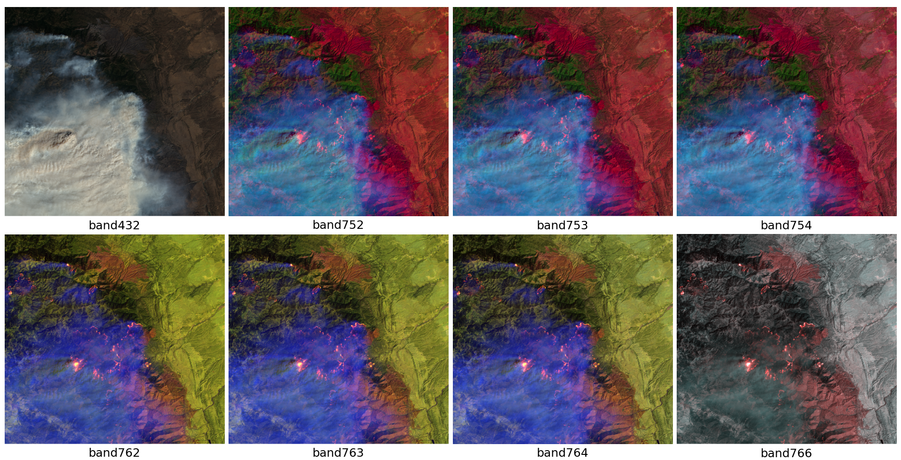
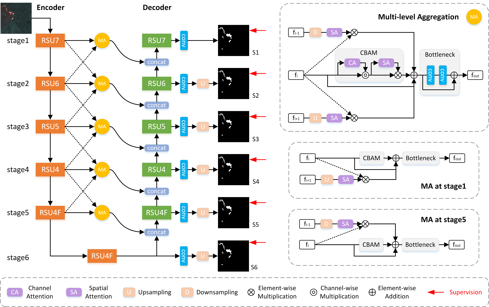

<h1>This is the official repo for FPS-U2Net created 
by Voruarn, from School of Computer Science, NUIST, Nanjing, China. </h1>
<h3>Update: December 2023.</h3>

<h3>Figure 1: Landsat8 composite images with different band combinations.</h3>

<h3>The structure of the proposed FPS-U2Net.</h3>

